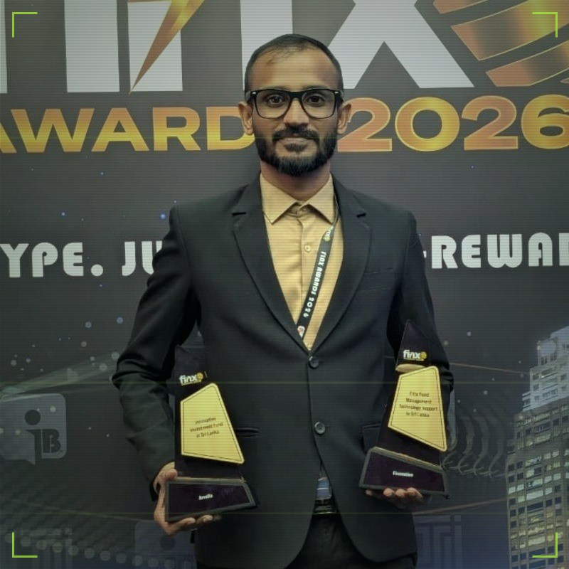

# Mizhar Raja

**Chief Technology Officer @ Finovation Technologies · Full Stack Web Developer · MSc Software Engineering**

I turn complex business problems into elegant, scalable software — a decade of crafting
fintech platforms, e-commerce engines and enterprise systems that just work.

[**🌐 Live Portfolio**](https://mizhar.finovationtech.com/) &nbsp;·&nbsp; [**📄 Download CV**](cv.pdf) &nbsp;·&nbsp; [**✉️ Get in Touch**](mailto:mizhar.raja@outlook.com)

 

<table align="center">
  <tr>
    <td align="center">🚀 <b>10+</b></td>
    <td align="center">📦 <b>50+</b></td>
    <td align="center">🎓 <b>MSc</b></td>
    <td align="center">🧰 <b>15+</b></td>
    <td align="center">🏆 <b>2×</b></td>
  </tr>
  <tr>
    <td align="center">Years of experience</td>
    <td align="center">Projects delivered</td>
    <td align="center">Software Engineering, 2025</td>
    <td align="center">Frameworks &amp; platforms</td>
    <td align="center">FinX Awards 2026</td>
  </tr>
</table>

---

## 💫 About Me

Hey — I'm **Mizhar**, a software engineer from Sri Lanka who has spent the last ten years turning ideas
into working products. Today I serve as **CTO at Finovation Technologies**, leading the engineering behind
a fintech trading platform. Before that, my journey ran from a web shop in Puttalam through the agency
scene in Dubai and back home to senior roles in fast-moving product teams.

- 🏦 **CTO at Finovation Technologies** — leading fintech engineering & architecture
- 🛠️ Enterprise systems, e-commerce and automation delivered **end to end**
- 🌏 Experience across **Sri Lanka and the UAE** — from agencies to product teams
- 🎓 **MSc in Software Engineering (2025)** — architecture with academic rigor
- 🤖 **Prompt engineering & AI tooling** as daily force multipliers

---

## 💼 Experience

| Period | Role | Company |
|---|---|---|
| **2024 — Present** | Chief Technology Officer (CTO) | **Finovation Technologies** · Fintech |
| **2022 — 2024** | Senior Full Stack Developer | **AdsflyCircle** · Advertising technology |
| **2018 — 2022** | Senior Full Stack Developer | **Silver Rays Technologies** ([adsfly.lk](http://adsfly.lk)) · Puttalam, Sri Lanka |
| **2017 — 2018** | Web Developer | **Excellence Code** · Dubai, UAE |
| **2015 — 2017** | Web Developer | **Prego International** · Dubai, UAE |

---

## 🚀 Featured Projects

| Project | What it does | Stack / Context |
|---|---|---|
| **Finovation CRM Trading Platform** | Enterprise CRM + trading platform powering Finovation's operations — architecture, data model and delivery led end-to-end as CTO. Its technology earned the *Elite Fund Management Technology Support* trophy at the **FinX Awards 2026**. | Fintech · CRM · Enterprise |
| **Multi-Marketplace Re-Pricer** | Cross-marketplace repricing engine wired into Keepa's price-intelligence API — one dashboard watching eBay, Amazon, OnBuy and Walmart, adjusting listings automatically. | APIs · Keepa |
| **Selenium Automation Suite** | Automation pipelines handling repetitive browser work at scale — headless browsers doing the boring jobs reliably. | Selenium · Automation |
| **Repricer for Dropshippers** | A pricing brain that never sleeps — automated repricing that keeps dropshipping listings competitive around the clock. | E-commerce · Automation |
| **POS & Order Management** | A self-built retail backbone — point-of-sale, inventory, billing and fulfilment flowing through one clean system. | Product · Retail |
| **Forex Trading EA Scripts** | Algorithmic trading on autopilot — Expert Advisors for MetaTrader 4 with strategy logic, risk controls and backtesting. | MT4 · MQL4 |

**50+ builds in total** — client websites, mobile apps, warehouse & ticketing systems and more — on the [live portfolio →](https://mizhar.finovationtech.com/#projects)

---

## 💻 Tech Stack

**Languages**

**Backend**

**Frontend**

**Mobile**

**Databases**

**Cloud & DevOps**

![AWS](https://img.shields.io/badge/AWS-232F3E?style=flat-square&logo=data:image/svg%2Bxml;base64,PHN2ZyBmaWxsPSJ3aGl0ZSIgcm9sZT0iaW1nIiB2aWV3Qm94PSIwIDAgMjQgMjQiIHhtbG5zPSJodHRwOi8vd3d3LnczLm9yZy8yMDAwL3N2ZyI%2BPHRpdGxlPkFtYXpvbiBXZWIgU2VydmljZXM8L3RpdGxlPjxwYXRoIGQ9Ik02Ljc2MyAxMC4wMzZjMCAuMjk2LjAzMi41MzUuMDg4LjcxLjA2NC4xNzYuMTQ0LjM2OC4yNTYuNTc2LjA0LjA2My4wNTYuMTI3LjA1Ni4xODMgMCAuMDgtLjA0OC4xNi0uMTUyLjI0bC0uNTAzLjMzNWEuMzgzLjM4MyAwIDAgMS0uMjA4LjA3MmMtLjA4IDAtLjE2LS4wNC0uMjM5LS4xMTJhMi40NyAyLjQ3IDAgMCAxLS4yODctLjM3NSA2LjE4IDYuMTggMCAwIDEtLjI0OC0uNDcxYy0uNjIyLjczNC0xLjQwNSAxLjEwMS0yLjM0NyAxLjEwMS0uNjcgMC0xLjIwNS0uMTkxLTEuNTk2LS41NzQtLjM5MS0uMzg0LS41OS0uODk0LS41OS0xLjUzMyAwLS42NzguMjM5LTEuMjMuNzI2LTEuNjQ0LjQ4Ny0uNDE1IDEuMTMzLS42MjMgMS45NTUtLjYyMy4yNzIgMCAuNTUxLjAyNC44NDYuMDY0LjI5Ni4wNC42LjEwNC45MTguMTc2di0uNTgzYzAtLjYwNy0uMTI3LTEuMDMtLjM3NS0xLjI3Ny0uMjU1LS4yNDgtLjY4Ni0uMzY3LTEuMy0uMzY3LS4yOCAwLS41NjguMDMxLS44NjMuMTAzLS4yOTUuMDcyLS41ODMuMTYtLjg2Mi4yNzJhMi4yODcgMi4yODcgMCAwIDEtLjI4LjEwNC40ODguNDg4IDAgMCAxLS4xMjcuMDIzYy0uMTEyIDAtLjE2OC0uMDgtLjE2OC0uMjQ3di0uMzkxYzAtLjEyOC4wMTYtLjIyNC4wNTYtLjI4YS41OTcuNTk3IDAgMCAxIC4yMjQtLjE2N2MuMjc5LS4xNDQuNjE0LS4yNjQgMS4wMDUtLjM2YTQuODQgNC44NCAwIDAgMSAxLjI0Ni0uMTUxYy45NSAwIDEuNjQ0LjIxNiAyLjA5MS42NDcuNDM5LjQzLjY2MiAxLjA4NS42NjIgMS45NjN2Mi41ODZ6bS0zLjI0IDEuMjE0Yy4yNjMgMCAuNTM0LS4wNDguODIyLS4xNDQuMjg3LS4wOTYuNTQzLS4yNzEuNzU4LS41MS4xMjgtLjE1Mi4yMjQtLjMyLjI3Mi0uNTEyLjA0Ny0uMTkxLjA4LS40MjMuMDgtLjY5NHYtLjMzNWE2LjY2IDYuNjYgMCAwIDAtLjczNS0uMTM2IDYuMDIgNi4wMiAwIDAgMC0uNzUtLjA0OGMtLjUzNSAwLS45MjYuMTA0LTEuMTkuMzItLjI2My4yMTUtLjM5LjUxOC0uMzkuOTE3IDAgLjM3NS4wOTUuNjU1LjI5NS44NDYuMTkxLjIuNDcuMjk2LjgzOC4yOTZ6bTYuNDEuODYyYy0uMTQ0IDAtLjI0LS4wMjQtLjMwNC0uMDgtLjA2NC0uMDQ4LS4xMi0uMTYtLjE2OC0uMzExTDcuNTg2IDUuNTVhMS4zOTggMS4zOTggMCAwIDEtLjA3Mi0uMzJjMC0uMTI4LjA2NC0uMi4xOTEtLjJoLjc4M2MuMTUxIDAgLjI1NS4wMjUuMzEuMDguMDY1LjA0OC4xMTMuMTYuMTYuMzEybDEuMzQyIDUuMjg0IDEuMjQ1LTUuMjg0Yy4wNC0uMTYuMDg4LS4yNjQuMTUxLS4zMTJhLjU0OS41NDkgMCAwIDEgLjMyLS4wOGguNjM4Yy4xNTIgMCAuMjU2LjAyNS4zMi4wOC4wNjMuMDQ4LjEyLjE2LjE1MS4zMTJsMS4yNjEgNS4zNDggMS4zODEtNS4zNDhjLjA0OC0uMTYuMTA0LS4yNjQuMTYtLjMxMmEuNTIuNTIgMCAwIDEgLjMxMS0uMDhoLjc0M2MuMTI3IDAgLjIuMDY1LjIuMiAwIC4wNC0uMDA5LjA4LS4wMTcuMTI4YTEuMTM3IDEuMTM3IDAgMCAxLS4wNTYuMmwtMS45MjMgNi4xN2MtLjA0OC4xNi0uMTA0LjI2My0uMTY4LjMxMWEuNTEuNTEgMCAwIDEtLjMwMy4wOGgtLjY4N2MtLjE1MSAwLS4yNTUtLjAyNC0uMzItLjA4LS4wNjMtLjA1Ni0uMTE5LS4xNi0uMTUtLjMybC0xLjIzOC01LjE0OC0xLjIzIDUuMTRjLS4wNC4xNi0uMDg3LjI2NC0uMTUuMzItLjA2NS4wNTYtLjE3Ny4wOC0uMzIuMDh6bTEwLjI1Ni4yMTVjLS40MTUgMC0uODMtLjA0OC0xLjIyOS0uMTQzLS4zOTktLjA5Ni0uNzEtLjItLjkxOC0uMzItLjEyOC0uMDcxLS4yMTUtLjE1MS0uMjQ3LS4yMjNhLjU2My41NjMgMCAwIDEtLjA0OC0uMjI0di0uNDA3YzAtLjE2Ny4wNjQtLjI0Ny4xODMtLjI0Ny4wNDggMCAuMDk2LjAwOC4xNDQuMDI0LjA0OC4wMTYuMTIuMDQ4LjIuMDguMjcxLjEyLjU2Ni4yMTUuODc4LjI3OS4zMTkuMDY0LjYzLjA5Ni45NS4wOTYuNTAyIDAgLjg5NC0uMDg4IDEuMTY1LS4yNjRhLjg2Ljg2IDAgMCAwIC40MTUtLjc1OC43NzcuNzc3IDAgMCAwLS4yMTUtLjU1OWMtLjE0NC0uMTUxLS40MTYtLjI4Ny0uODA3LS40MTVsLTEuMTU3LS4zNmMtLjU4My0uMTgzLTEuMDE0LS40NTQtMS4yNzctLjgxM2ExLjkwMiAxLjkwMiAwIDAgMS0uNC0xLjE1OGMwLS4zMzUuMDczLS42My4yMTYtLjg4Ni4xNDQtLjI1NS4zMzUtLjQ3OS41NzUtLjY1NC4yNC0uMTg0LjUxLS4zMi44My0uNDE1LjMyLS4wOTYuNjU1LS4xMzYgMS4wMDYtLjEzNi4xNzUgMCAuMzU5LjAwOC41MzUuMDMyLjE4My4wMjQuMzUuMDU2LjUxOC4wODguMTYuMDQuMzEyLjA4LjQ1NS4xMjcuMTQ0LjA0OC4yNTYuMDk2LjMzNi4xNDRhLjY5LjY5IDAgMCAxIC4yNC4yLjQzLjQzIDAgMCAxIC4wNzEuMjYzdi4zNzVjMCAuMTY4LS4wNjQuMjU2LS4xODQuMjU2YS44My44MyAwIDAgMS0uMzAzLS4wOTYgMy42NTIgMy42NTIgMCAwIDAtMS41MzItLjMxMWMtLjQ1NSAwLS44MTUuMDcxLTEuMDYyLjIyMy0uMjQ4LjE1Mi0uMzc1LjM4My0uMzc1LjcxIDAgLjIyNC4wOC40MTYuMjQuNTY3LjE1OS4xNTIuNDU0LjMwNC44NzcuNDRsMS4xMzQuMzU4Yy41NzQuMTg0Ljk5LjQ0IDEuMjM3Ljc2Ny4yNDcuMzI3LjM2Ny43MDIuMzY3IDEuMTE3IDAgLjM0My0uMDcyLjY1NS0uMjA3LjkyNi0uMTQ0LjI3Mi0uMzM2LjUxMS0uNTgzLjcwMy0uMjQ4LjItLjU0My4zNDMtLjg4Ni40NDctLjM2LjExMS0uNzM0LjE2Ny0xLjE0Mi4xNjd6TTIxLjY5OCAxNi4yMDdjLTIuNjI2IDEuOTQtNi40NDIgMi45NjktOS43MjIgMi45NjktNC41OTggMC04Ljc0LTEuNy0xMS44Ny00LjUyNi0uMjQ3LS4yMjMtLjAyNC0uNTI3LjI3Mi0uMzUxIDMuMzg0IDEuOTYzIDcuNTU5IDMuMTUzIDExLjg3NyAzLjE1MyAyLjkxNCAwIDYuMTE0LS42MDcgOS4wNi0xLjg1Mi40MzktLjIuODE0LjI4Ny4zODMuNjA3ek0yMi43OTIgMTQuOTYxYy0uMzM2LS40My0yLjIyLS4yMDctMy4wNzQtLjEwMy0uMjU1LjAzMi0uMjk1LS4xOTItLjA2My0uMzYgMS41LTEuMDUzIDMuOTY3LS43NSA0LjI1NC0uMzk5LjI4Ny4zNi0uMDggMi44MjYtMS40ODUgNC4wMDctLjIxNS4xODQtLjQyMy4wODgtLjMyNy0uMTUxLjMyLS43OSAxLjAzLTIuNTcuNjk1LTIuOTk0eiIvPjwvc3ZnPg%3D%3D&logoColor=white)

**CMS, Automation & Tools**

---

## 🤖 The AI-Augmented Engineer

> I don't compete with AI — **I compound with it.** Prompt engineering, AI tooling and LLM-powered
> automation are now part of how I build.

- **Prompt Engineering** — structured prompts, system messages and context design
- **AI-Assisted Development** — ChatGPT, Claude and GitHub Copilot in the daily toolchain
- **LLM API Integration** — chatbots, RAG knowledge bases and AI workflow automation
- **AI × Automation** — bots and pipelines that don't just click buttons, they make decisions

![ChatGPT](https://img.shields.io/badge/ChatGPT-74AA9C?style=flat-square&logo=data:image/svg%2Bxml;base64,PHN2ZyBmaWxsPSJ3aGl0ZSIgcm9sZT0iaW1nIiB2aWV3Qm94PSIwIDAgMjQgMjQiIHhtbG5zPSJodHRwOi8vd3d3LnczLm9yZy8yMDAwL3N2ZyI%2BPHRpdGxlPk9wZW5BSTwvdGl0bGU%2BPHBhdGggZD0iTTIyLjI4MTkgOS44MjExYTUuOTg0NyA1Ljk4NDcgMCAwIDAtLjUxNTctNC45MTA4IDYuMDQ2MiA2LjA0NjIgMCAwIDAtNi41MDk4LTIuOUE2LjA2NTEgNi4wNjUxIDAgMCAwIDQuOTgwNyA0LjE4MThhNS45ODQ3IDUuOTg0NyAwIDAgMC0zLjk5NzcgMi45IDYuMDQ2MiA2LjA0NjIgMCAwIDAgLjc0MjcgNy4wOTY2IDUuOTggNS45OCAwIDAgMCAuNTExIDQuOTEwNyA2LjA1MSA2LjA1MSAwIDAgMCA2LjUxNDYgMi45MDAxQTUuOTg0NyA1Ljk4NDcgMCAwIDAgMTMuMjU5OSAyNGE2LjA1NTcgNi4wNTU3IDAgMCAwIDUuNzcxOC00LjIwNTggNS45ODk0IDUuOTg5NCAwIDAgMCAzLjk5NzctMi45MDAxIDYuMDU1NyA2LjA1NTcgMCAwIDAtLjc0NzUtNy4wNzI5em0tOS4wMjIgMTIuNjA4MWE0LjQ3NTUgNC40NzU1IDAgMCAxLTIuODc2NC0xLjA0MDhsLjE0MTktLjA4MDQgNC43NzgzLTIuNzU4MmEuNzk0OC43OTQ4IDAgMCAwIC4zOTI3LS42ODEzdi02LjczNjlsMi4wMiAxLjE2ODZhLjA3MS4wNzEgMCAwIDEgLjAzOC4wNTJ2NS41ODI2YTQuNTA0IDQuNTA0IDAgMCAxLTQuNDk0NSA0LjQ5NDR6bS05LjY2MDctNC4xMjU0YTQuNDcwOCA0LjQ3MDggMCAwIDEtLjUzNDYtMy4wMTM3bC4xNDIuMDg1MiA0Ljc4MyAyLjc1ODJhLjc3MTIuNzcxMiAwIDAgMCAuNzgwNiAwbDUuODQyOC0zLjM2ODV2Mi4zMzI0YS4wODA0LjA4MDQgMCAwIDEtLjAzMzIuMDYxNUw5Ljc0IDE5Ljk1MDJhNC40OTkyIDQuNDk5MiAwIDAgMS02LjE0MDgtMS42NDY0ek0yLjM0MDggNy44OTU2YTQuNDg1IDQuNDg1IDAgMCAxIDIuMzY1NS0xLjk3MjhWMTEuNmEuNzY2NC43NjY0IDAgMCAwIC4zODc5LjY3NjVsNS44MTQ0IDMuMzU0My0yLjAyMDEgMS4xNjg1YS4wNzU3LjA3NTcgMCAwIDEtLjA3MSAwbC00LjgzMDMtMi43ODY1QTQuNTA0IDQuNTA0IDAgMCAxIDIuMzQwOCA3Ljg3MnptMTYuNTk2MyAzLjg1NThMMTMuMTAzOCA4LjM2NCAxNS4xMTkyIDcuMmEuMDc1Ny4wNzU3IDAgMCAxIC4wNzEgMGw0LjgzMDMgMi43OTEzYTQuNDk0NCA0LjQ5NDQgMCAwIDEtLjY3NjUgOC4xMDQydi01LjY3NzJhLjc5Ljc5IDAgMCAwLS40MDctLjY2N3ptMi4wMTA3LTMuMDIzMWwtLjE0Mi0uMDg1Mi00Ljc3MzUtMi43ODE4YS43NzU5Ljc3NTkgMCAwIDAtLjc4NTQgMEw5LjQwOSA5LjIyOTdWNi44OTc0YS4wNjYyLjA2NjIgMCAwIDEgLjAyODQtLjA2MTVsNC44MzAzLTIuNzg2NmE0LjQ5OTIgNC40OTkyIDAgMCAxIDYuNjgwMiA0LjY2ek04LjMwNjUgMTIuODYzbC0yLjAyLTEuMTYzOGEuMDgwNC4wODA0IDAgMCAxLS4wMzgtLjA1NjdWNi4wNzQyYTQuNDk5MiA0LjQ5OTIgMCAwIDEgNy4zNzU3LTMuNDUzN2wtLjE0Mi4wODA1TDguNzA0IDUuNDU5YS43OTQ4Ljc5NDggMCAwIDAtLjM5MjcuNjgxM3ptMS4wOTc2LTIuMzY1NGwyLjYwMi0xLjQ5OTggMi42MDY5IDEuNDk5OHYyLjk5OTRsLTIuNTk3NCAxLjQ5OTctMi42MDY3LTEuNDk5N1oiLz48L3N2Zz4%3D&logoColor=white)

![OpenAI API](https://img.shields.io/badge/OpenAI_API-412991?style=flat-square&logo=data:image/svg%2Bxml;base64,PHN2ZyBmaWxsPSJ3aGl0ZSIgcm9sZT0iaW1nIiB2aWV3Qm94PSIwIDAgMjQgMjQiIHhtbG5zPSJodHRwOi8vd3d3LnczLm9yZy8yMDAwL3N2ZyI%2BPHRpdGxlPk9wZW5BSTwvdGl0bGU%2BPHBhdGggZD0iTTIyLjI4MTkgOS44MjExYTUuOTg0NyA1Ljk4NDcgMCAwIDAtLjUxNTctNC45MTA4IDYuMDQ2MiA2LjA0NjIgMCAwIDAtNi41MDk4LTIuOUE2LjA2NTEgNi4wNjUxIDAgMCAwIDQuOTgwNyA0LjE4MThhNS45ODQ3IDUuOTg0NyAwIDAgMC0zLjk5NzcgMi45IDYuMDQ2MiA2LjA0NjIgMCAwIDAgLjc0MjcgNy4wOTY2IDUuOTggNS45OCAwIDAgMCAuNTExIDQuOTEwNyA2LjA1MSA2LjA1MSAwIDAgMCA2LjUxNDYgMi45MDAxQTUuOTg0NyA1Ljk4NDcgMCAwIDAgMTMuMjU5OSAyNGE2LjA1NTcgNi4wNTU3IDAgMCAwIDUuNzcxOC00LjIwNTggNS45ODk0IDUuOTg5NCAwIDAgMCAzLjk5NzctMi45MDAxIDYuMDU1NyA2LjA1NTcgMCAwIDAtLjc0NzUtNy4wNzI5em0tOS4wMjIgMTIuNjA4MWE0LjQ3NTUgNC40NzU1IDAgMCAxLTIuODc2NC0xLjA0MDhsLjE0MTktLjA4MDQgNC43NzgzLTIuNzU4MmEuNzk0OC43OTQ4IDAgMCAwIC4zOTI3LS42ODEzdi02LjczNjlsMi4wMiAxLjE2ODZhLjA3MS4wNzEgMCAwIDEgLjAzOC4wNTJ2NS41ODI2YTQuNTA0IDQuNTA0IDAgMCAxLTQuNDk0NSA0LjQ5NDR6bS05LjY2MDctNC4xMjU0YTQuNDcwOCA0LjQ3MDggMCAwIDEtLjUzNDYtMy4wMTM3bC4xNDIuMDg1MiA0Ljc4MyAyLjc1ODJhLjc3MTIuNzcxMiAwIDAgMCAuNzgwNiAwbDUuODQyOC0zLjM2ODV2Mi4zMzI0YS4wODA0LjA4MDQgMCAwIDEtLjAzMzIuMDYxNUw5Ljc0IDE5Ljk1MDJhNC40OTkyIDQuNDk5MiAwIDAgMS02LjE0MDgtMS42NDY0ek0yLjM0MDggNy44OTU2YTQuNDg1IDQuNDg1IDAgMCAxIDIuMzY1NS0xLjk3MjhWMTEuNmEuNzY2NC43NjY0IDAgMCAwIC4zODc5LjY3NjVsNS44MTQ0IDMuMzU0My0yLjAyMDEgMS4xNjg1YS4wNzU3LjA3NTcgMCAwIDEtLjA3MSAwbC00LjgzMDMtMi43ODY1QTQuNTA0IDQuNTA0IDAgMCAxIDIuMzQwOCA3Ljg3MnptMTYuNTk2MyAzLjg1NThMMTMuMTAzOCA4LjM2NCAxNS4xMTkyIDcuMmEuMDc1Ny4wNzU3IDAgMCAxIC4wNzEgMGw0LjgzMDMgMi43OTEzYTQuNDk0NCA0LjQ5NDQgMCAwIDEtLjY3NjUgOC4xMDQydi01LjY3NzJhLjc5Ljc5IDAgMCAwLS40MDctLjY2N3ptMi4wMTA3LTMuMDIzMWwtLjE0Mi0uMDg1Mi00Ljc3MzUtMi43ODE4YS43NzU5Ljc3NTkgMCAwIDAtLjc4NTQgMEw5LjQwOSA5LjIyOTdWNi44OTc0YS4wNjYyLjA2NjIgMCAwIDEgLjAyODQtLjA2MTVsNC44MzAzLTIuNzg2NmE0LjQ5OTIgNC40OTkyIDAgMCAxIDYuNjgwMiA0LjY2ek04LjMwNjUgMTIuODYzbC0yLjAyLTEuMTYzOGEuMDgwNC4wODA0IDAgMCAxLS4wMzgtLjA1NjdWNi4wNzQyYTQuNDk5MiA0LjQ5OTIgMCAwIDEgNy4zNzU3LTMuNDUzN2wtLjE0Mi4wODA1TDguNzA0IDUuNDU5YS43OTQ4Ljc5NDggMCAwIDAtLjM5MjcuNjgxM3ptMS4wOTc2LTIuMzY1NGwyLjYwMi0xLjQ5OTggMi42MDY5IDEuNDk5OHYyLjk5OTRsLTIuNTk3NCAxLjQ5OTctMi42MDY3LTEuNDk5N1oiLz48L3N2Zz4%3D&logoColor=white)

---

## 🎓 Education

| Period | Qualification | Institution |
|---|---|---|
| **2023 — 2025** | MSc in Software Engineering | Postgraduate degree · completed 2025 |
| **2012 — 2014** | BTEC HND in Computing | BCAS City Campus · Edexcel (UK) |
| **2011 — 2012** | ACCESS Programme — Degree Foundation | BCAS · Top performer, 6 certifications |
| **2010 — 2011** | Hardware with Networking | ICBT City Campus |
| **1997 — 2008** | Grade 3 — 13 · Grade 5 Scholarship ✅ · G.C.E. O/L ✅ · G.C.E. A/L ✅ | Puttalam Hindu Central College |
| **1995 — 1996** | Grade 1 — 2 | Puttalam Fathima Balika Maha Vidyalaya |

---

## ⚽ Beyond the Code — Sports & Activities

- ⚽ **Football** — main squad player, **Puttalam Wimbledon Soccer Club** (2005 — present)
- 🏏 **Cricket** — hardball cricketer, school team (2005 — 2008)
- ♟️ **Chess** — active player
- 🏃 **Athletics** — 100m, 200m, 400m, long jump & high jump — medals and certificates from school competitions

---

## 🏆 Awards

**FinX Awards 2026 — Sri Lanka · Winner**

🏅 *Elite Fund Management Technology Support* &nbsp;·&nbsp; 🏅 *Innovative Investment Fund*

---

## 📫 Contact

| Channel | Details |
|---|---|
| ✉️ **Email** | [mizhar.raja@outlook.com](mailto:mizhar.raja@outlook.com) · [m.n.m.mizhar@gmail.com](mailto:m.n.m.mizhar@gmail.com) |
| 📱 **Phone / WhatsApp** | [+94 77 601 2200](https://wa.me/94776012200) · [+94 72 601 2200](https://wa.me/94726012200) |
| 📍 **Location** | Puttalam, Sri Lanka |
| 🌐 **Website** | [mizhar.finovationtech.com](https://mizhar.finovationtech.com/) · mirror: [mizhar.adsflycircle.com](https://mizhar.adsflycircle.com/) |

---

*Whether you need a CTO's eye on your architecture, a full-stack developer to ship your product,
or automation that saves your team hours every week — I'd love to hear about it.*

**[Let's make it real →](mailto:mizhar.raja@outlook.com)**

 

